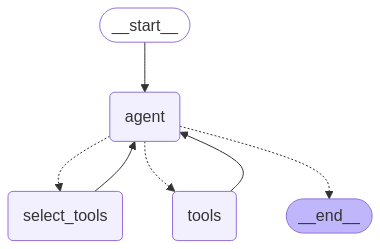

# langgraph-bigtool

`langgraph-bigtool` is a Python library for creating
[LangGraph](https://langchain-ai.github.io/langgraph/) agents that can access large
numbers of tools. It leverages LangGraph's long-term
[memory store](https://langchain-ai.github.io/langgraph/how-tos/memory/semantic-search/)
to allow an agent to search for and retrieve relevant tools for a given problem.

## Features

- 🧰 **Scalable access to tools**: Equip agents with hundreds or thousands of tools.
- 📝 **Storage of tool metadata**: Control storage of tool descriptions, namespaces,
and other information through LangGraph's built-in
[persistence layer](https://langchain-ai.github.io/langgraph/concepts/persistence/).
Includes support for
[in-memory](https://langchain-ai.github.io/langgraph/how-tos/cross-thread-persistence/)
and
[Postgres](https://langchain-ai.github.io/langgraph/reference/store/#langgraph.store.postgres.PostgresStore)
backends.
- 💡 **Customization of tool retrieval**: Optionally define custom functions for tool retrieval.

This library is built on top of [LangGraph](https://github.com/langchain-ai/langgraph), a powerful framework for building agent applications, and comes with out-of-box support for [streaming](https://langchain-ai.github.io/langgraph/how-tos/#streaming), [short-term and long-term memory](https://langchain-ai.github.io/langgraph/concepts/memory/) and [human-in-the-loop](https://langchain-ai.github.io/langgraph/concepts/human_in_the_loop/).

## Installation

```bash
pip install langgraph-bigtool
```

## Quickstart

We demonstrate `langgraph-bigtool` by equipping an agent with all functions from
Python's built-in `math` library.

> [!NOTE]
> This includes about 50 tools. Some LLMs can handle this number of tools together in
a single invocation without issue. This example is for demonstration purposes.

```bash
pip install langgraph-bigtool "langchain[openai]"

export OPENAI_API_KEY=<your_api_key>
```

```python
import math
import types
import uuid

from langchain.chat_models import init_chat_model
from langchain.embeddings import init_embeddings
from langgraph.store.memory import InMemoryStore

from langgraph_bigtool import create_agent
from langgraph_bigtool.utils import (
    convert_positional_only_function_to_tool
)

# Collect functions from `math` built-in
all_tools = []
for function_name in dir(math):
    function = getattr(math, function_name)
    if not isinstance(
        function, types.BuiltinFunctionType
    ):
        continue
    # This is an idiosyncrasy of the `math` library
    if tool := convert_positional_only_function_to_tool(
        function
    ):
        all_tools.append(tool)

# Create registry of tools. This is a dict mapping
# identifiers to tool instances.
tool_registry = {
    str(uuid.uuid4()): tool
    for tool in all_tools
}

# Index tool names and descriptions in the LangGraph
# Store. Here we use a simple in-memory store.
embeddings = init_embeddings("openai:text-embedding-3-small")

store = InMemoryStore(
    index={
        "embed": embeddings,
        "dims": 1536,
        "fields": ["description"],
    }
)
for tool_id, tool in tool_registry.items():
    store.put(
        ("tools",),
        tool_id,
        {
            "description": f"{tool.name}: {tool.description}",
        },
    )

# Initialize agent
llm = init_chat_model("openai:gpt-4o-mini")

builder = create_agent(llm, tool_registry)
agent = builder.compile(store=store)
agent
```

```python
query = "Use available tools to calculate arc cosine of 0.5."

# Test it out
for step in agent.stream(
    {"messages": query},
    stream_mode="updates",
):
    for _, update in step.items():
        for message in update.get("messages", []):
            message.pretty_print()
```
```
================================== Ai Message ==================================
Tool Calls:
  retrieve_tools (call_nYZy6waIhivg94ZFhz3ju4K0)
 Call ID: call_nYZy6waIhivg94ZFhz3ju4K0
  Args:
    query: arc cosine calculation
================================= Tool Message =================================

Available tools: ['cos', 'acos']
================================== Ai Message ==================================
Tool Calls:
  acos (call_ynI4zBlJqXg4jfR21fVKDTTD)
 Call ID: call_ynI4zBlJqXg4jfR21fVKDTTD
  Args:
    x: 0.5
================================= Tool Message =================================
Name: acos

1.0471975511965976
================================== Ai Message ==================================

The arc cosine of 0.5 is approximately 1.0472 radians.
```

### Customizing tool retrieval

`langgraph-bigtool` equips an agent with a tool that is used to retrieve tools in
the registry. You can customize the retrieval by passing `retrieve_tools_function`
and / or `retrieve_tools_coroutine` into `create_agent`. These functions are expected
to return a list of IDs as output.
```python
from langgraph.prebuilt import InjectedStore
from langgraph.store.base import BaseStore
from typing_extensions import Annotated


def retrieve_tools(
    query: str,
    # Add custom arguments here...
    *,
    store: Annotated[BaseStore, InjectedStore],
) -> list[str]:
    """Retrieve a tool to use, given a search query."""
    results = store.search(("tools",), query=query, limit=2)
    tool_ids = [result.key for result in results]
    # Insert your custom logic here...
    return tool_ids

builder = create_agent(
    llm, tool_registry, retrieve_tools_function=retrieve_tools
)
agent = builder.compile(store=store)
```

#### Retrieving tools without LangGraph Store
You can implement arbitrary logic for the tool retrieval, which does not have to run
semantic search against a query. Below, we return collections of tools corresponding
to categories:
```python
tool_registry = {
    "id_1": get_balance,
    "id_2": get_history,
    "id_3": create_ticket,
}

def retrieve_tools(
    category: Literal["billing", "service"],
) -> list[str]:
    """Get tools for a category."""
    if category == "billing":
        return ["id_1", "id_2"]
    else:
        return ["id_3"]
```
> [!TIP]
> Because the argument schema is inferred from type hints, type hinting the function
argument as a `Literal` will signal that the LLM should populate a categorical value.

## Related work

- [Toolshed: Scale Tool-Equipped Agents with Advanced RAG-Tool Fusion and Tool Knowledge Bases](
https://doi.org/10.48550/arXiv.2410.14594) - Lumer, E., Subbiah, V.K., Burke, J.A.,
Basavaraju, P.H. & Huber, A. (2024). arXiv:2410.14594.

- [Graph RAG-Tool Fusion](
https://doi.org/10.48550/arXiv.2502.07223) - Lumer, E., Basavaraju, P.H., Mason, M.,
Burke, J.A. & Subbiah, V.K. (2025). arXiv:2502.07223.

- https://github.com/quchangle1/LLM-Tool-Survey

- [Retrieval Models Aren't Tool-Savvy: Benchmarking Tool Retrieval for Large Language Models](
https://doi.org/10.48550/arXiv.2503.01763) - Shi, Z., Wang, Y., Yan, L., Ren, P.,
Wang, S., Yin, D. & Ren, Z. arXiv:2503.01763.
